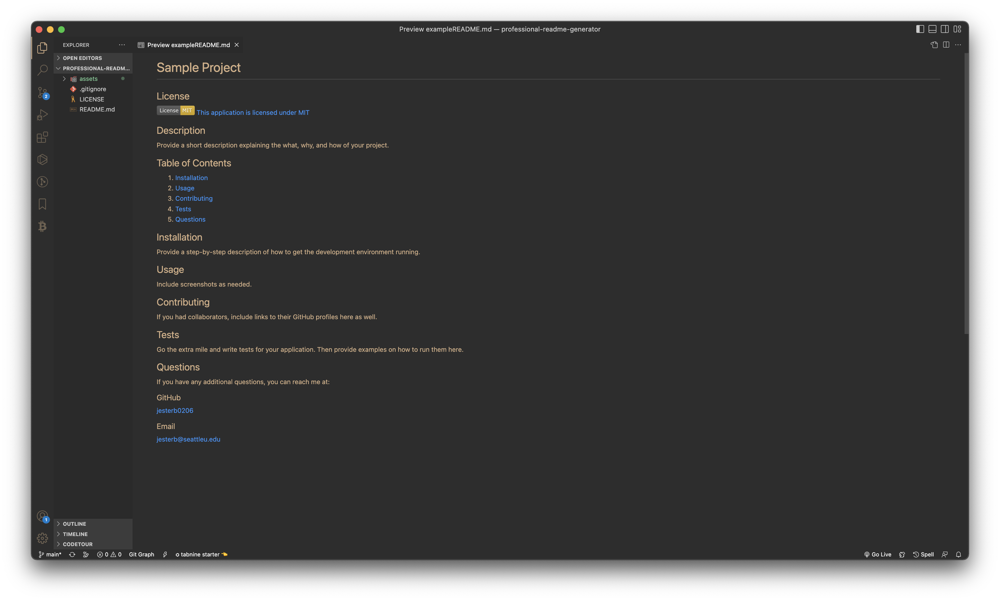
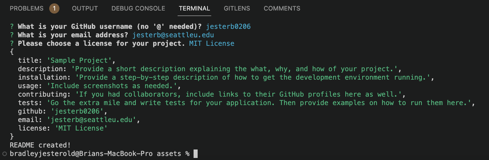

# Professional README Generator

## License

[This application is licensed under MIT](https://opensource.org/licenses/MIT)

## Description

My motivation for this project was to provide a simple solution to a tedious problem. I wanted to speed up the process of generating README markdown files and help others ensure that they are thorough with the information they provide. It can be time consuming to create a reade me for after every assignment, especially after finishing an extensive coding assignment. The last thing you want to do is spend more time worrying about formatting and other details. It is a timesaver so you can complete your task faster and focus on boosting your productivity in other areas. Through building this project I learned all about node modules, npm packages/dependencies, etc.

## Installation

Clone the repository to your local machine, open your terminal, and navigate to the assets folder in the Professional README Generator repository. To install the necessary dependencies, run `npm install` in the command-line terminal.

## Usage

### Sample README File

### Command-Line Prompts

### Video

Click on the video link below to learn how to use the Professional README Generator command-line application:

[Video](assets/video/professional_readme_generator_screen_recording.webm)

## Contributing

N/A

## Tests

N/A

## Questions

If you have any additional questions, you can reach me at:

### GitHub

[jesterb0206](https://www.github.com/jesterb0206)

### Email

jesterb@seattleu.edu
